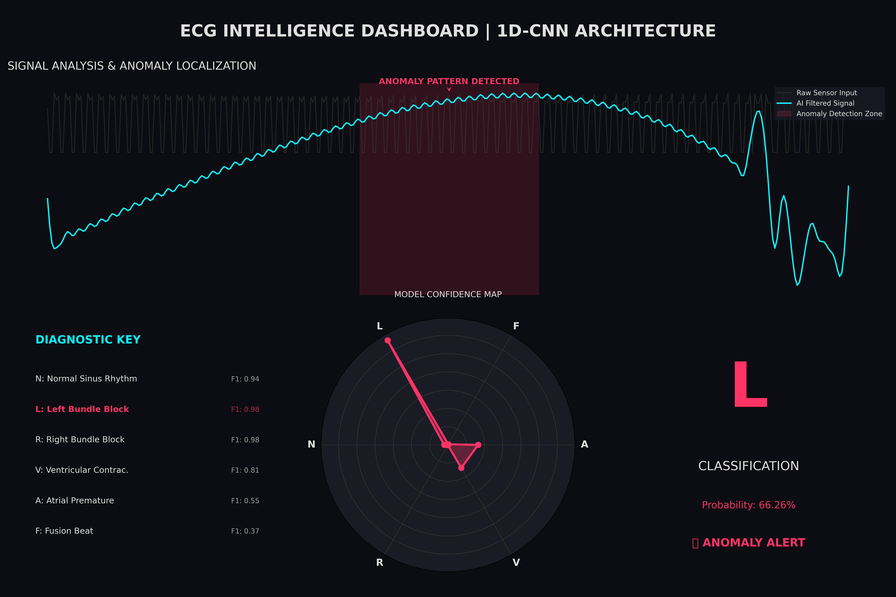

# MIT-BIH Arrhythmia Classification with 1D-CNN

This repository contains a PyTorch implementation of a 1D Convolutional Neural Network (1D-CNN) designed to classify ECG heartbeats from the **MIT-BIH Arrhythmia Database**. The model utilizes data augmentation and class weighting to handle the significant class imbalance found in the dataset.

## Project Overview

The pipeline automates the following steps:
* **Data Acquisition**: Downloads the MIT-BIH dataset using the `wfdb` library.
* **Preprocessing**: Applies a bandpass filter (0.5–40 Hz) to the MLII lead and normalizes segments based on the R-peak.
* **Augmentation**: Implements random Gaussian noise, baseline drift, and signal scaling to improve robustness.
* **Deep Learning**: Utilizes a 1D-CNN architecture with Batch Normalization and Global Adaptive Pooling.

### Class Mapping
The model classifies signals into six categories:
* **N**: Normal
* **L**: Left Bundle Branch Block
* **R**: Right Bundle Branch Block
* **A**: Atrial Premature Contraction
* **V**: Premature Ventricular Contraction
* **F**: Fusion of Ventricular and Normal

---

## Model Architecture

The 1D-CNN consists of three convolutional stages followed by a fully connected output layer:

| Layer | Kernel Size | Filters | Subsampling |
| :--- | :--- | :--- | :--- |
| Conv1D + BatchNorm + ReLU | 7 | 32 | MaxPool (2) |
| Conv1D + BatchNorm + ReLU | 5 | 64 | MaxPool (2) |
| Conv1D + BatchNorm + ReLU | 3 | 128 | AdaptiveAvgPool |
| Linear (Output) | - | 6 | - |

---

## Performance Results

The model was evaluated on a 20% stratified validation set.

### Classification Report


| Class | Precision | Recall | F1-Score | Support |
| :--- | :--- | :--- | :--- | :--- |
| **A** | 0.39 | 0.89 | 0.55 | 509 |
| **F** | 0.24 | 0.88 | 0.37 | 161 |
| **L** | 0.97 | 0.99 | 0.98 | 1614 |
| **N** | 1.00 | 0.88 | 0.94 | 15002 |
| **R** | 0.98 | 0.99 | 0.98 | 1451 |
| **V** | 0.70 | 0.97 | 0.81 | 1426 |
| **Accuracy** | | | **0.91** | 20163 |
| **Macro Avg** | 0.71 | 0.93 | 0.77 | 20163 |
| **Weighted Avg** | 0.95 | 0.91 | 0.92 | 20163 |


### Confusion Matrix


```text
[[  454     2     0    40     6     7]
 [    0   142     0     5     0    14]
 [    0     0  1597     3     0    14]
 [  676   440    46 13264    22   554]
 [   15     0     0     2  1433     1]
 [    8    17     4     9     3  1385]]
```
 ---

## Dashborad

